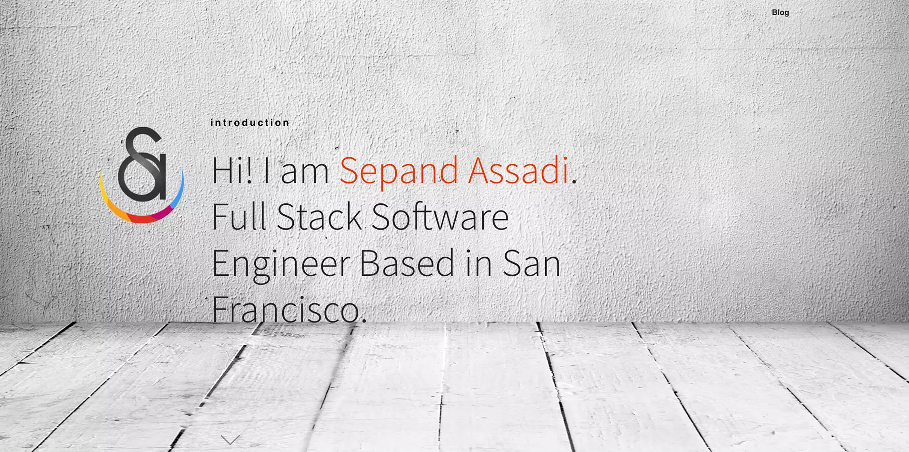
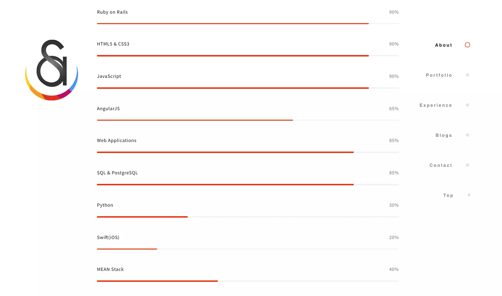
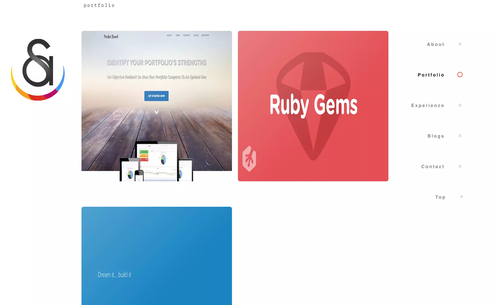
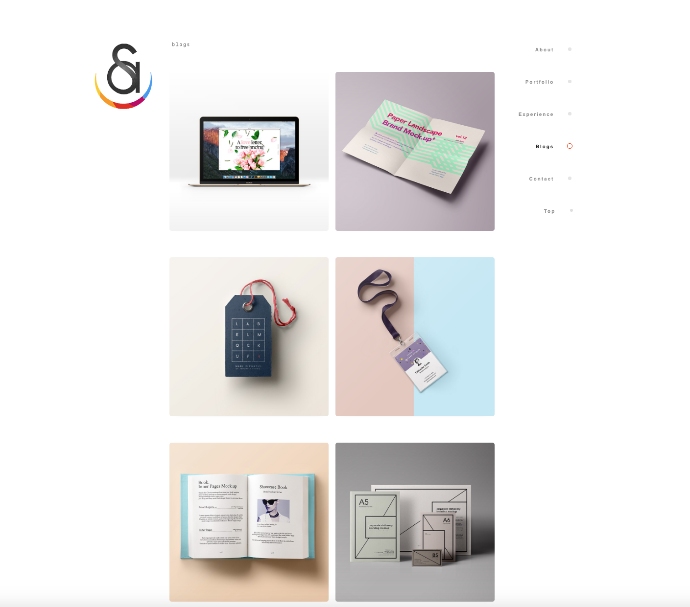
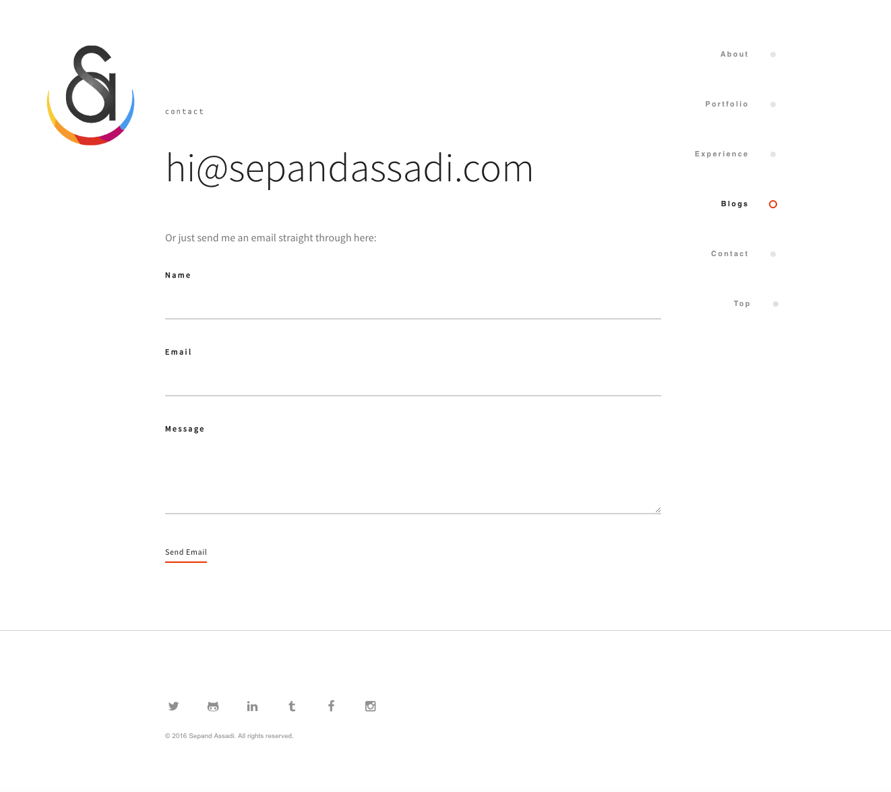
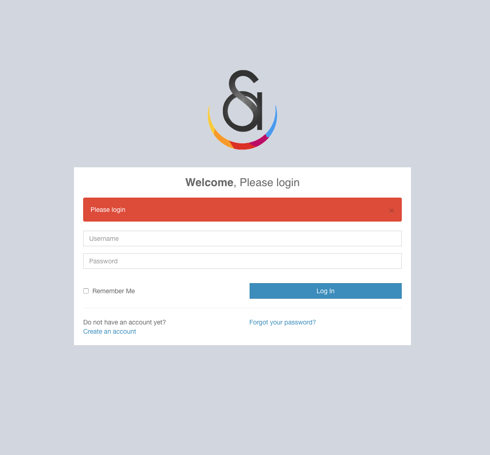

# Personal Website

## Schema

## User stories
#### Currently
- A user can login and logout
- A user can sign-up
- A user can create, view, edit and delete a blog page
- A user can create, view, edit and delete a blog post
- A user can create, view, edit and delete a blog post's tag
- A user can create, view, edit and delete a blog post's keywords
- A user can create, view, edit and delete a blog post's feature image
- A user can create, view, edit and delete a blog post's category name
- A user can create a status for a blog post (Draft or Published)
- Admin can create, edit, delete a user
- Admin can update website meta information
- Admin can create, edit, remove a welcome page

#### Future Options
- A user can create, view, edit and delete a page for their account (with role authentication)

## Showcase

###Homepage

- About

- Portfolio

- Experience

- Blog

- Contact Us

- Signup

- Login

- Forgot Password

- Dashboard

- Create A Post

- Blog Post

##Team

##Presentation
[Portfolio](https://sepandassadi.carbonmade.com/)

[Behance](https://www.behance.net/gallery/37433833/Personal-Website)

##Deployment Link
[Heroku](http://sepandassadi.com/)

[Blog Page](http://www.sepandassadi.com/blog)

[Admin Login](http://www.sepandassadi.com/blog/admin/login)

